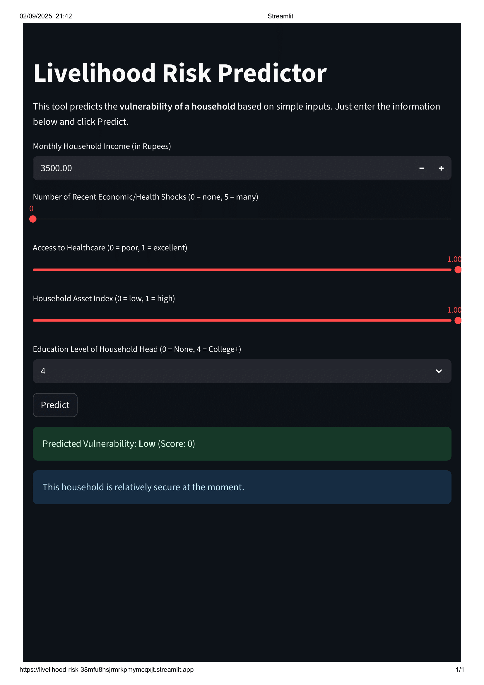
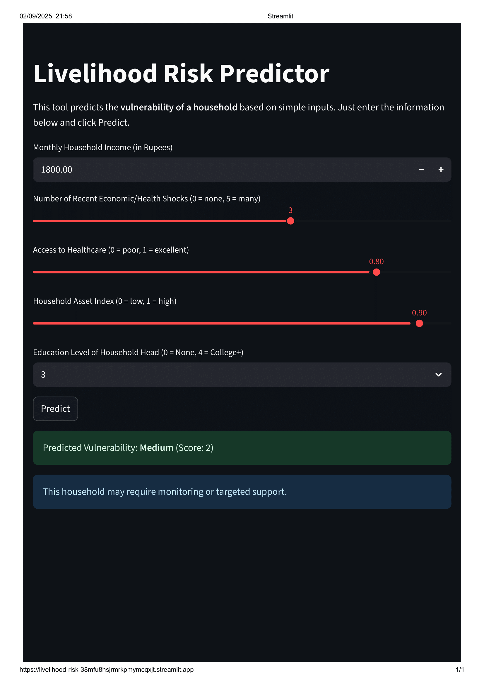
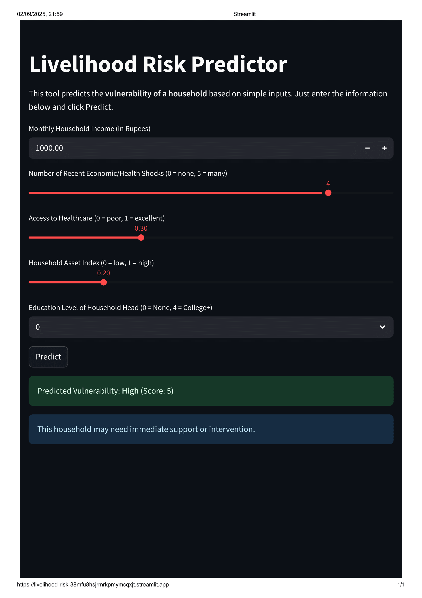

# Livelihood Risk Predictor

🔗 **Live Demo:** https://livelihood-risk-38mfu8hsjrmrkpmymcqxjt.streamlit.app/

---

## 📌 Problem Statement
NGOs, social organizations, and government agencies often struggle to quickly identify households that are **vulnerable to economic or health shocks**.  
Manual assessment is time-consuming and requires technical expertise.

---

## 💡 Solution
The **Livelihood Risk Predictor** is an interactive, user-friendly tool that predicts household vulnerability based on simple socio-economic inputs.  
It provides **actionable insights** for non-technical users, enabling organizations to **prioritize support** for high-risk households efficiently.

---

## 🚀 Key Features
- Input household data via a simple Streamlit dashboard  
- Calculates a **vulnerability score** using socio-economic indicators  
- Classifies households into **Low, Medium, or High risk**  
- Provides easy-to-understand output for quick decision-making  
- Optional API integration for programmatic access  

---

## 🛠 Tech Stack
- **Frontend:** Streamlit  
- **Backend:** Python  
- **ML / Data Processing:** Pandas, NumPy, scikit-learn  
- **Deployment:** Streamlit Cloud (or Render / Railway / Heroku)  
- **Optional API:** FastAPI  

---

## 🧠 How It Works
1. Users enter household information: income, shocks, health access, asset index, and education level.  
2. The tool calculates a **vulnerability score**:  
   - +1 for each risk factor (low income, high shocks, poor health access, low assets, low education)  
3. Maps the score to **risk levels**:  
   - 0–1 → Low Risk  
   - 2–3 → Medium Risk  
   - 4–5 → High Risk  

---

## 📊 Example Cases
| Example | Income (₹) | Shocks | Health Access | Asset Index | Education | Score | Predicted Risk |
|---------|------------|--------|---------------|-------------|-----------|-------|----------------|
| High Risk | 1000 | 4 | 0.3 | 0.2 | 0 | 5 | High |
| Medium Risk | 1800 | 3 | 0.8 | 0.9 | 3 | 2 | Medium |
| Low Risk | 3500 | 0 | 1.0 | 1.0 | 4 | 0 | Low |

---

## 🖥 Application Preview
  
  
  

> Screenshots show the user dashboard, input form, and risk prediction output.

---

## ⚙️ Installation & Usage

```bash
# Clone repository
git clone https://github.com/ge-studi/livelihood-risk-predictor.git
cd livelihood-risk-predictor
```

# Install dependencies
```bash
pip install -r requirements.txt
```

# Run Streamlit dashboard
```bash
streamlit run dashboard/streamlit-app.py
```

---

API Example: POST /predict with JSON:
```bash
{
  "income": 2000,
  "shocks": 2,
  "health_access": 0.5,
  "asset_index": 0.7,
  "education_level": 2
}
```
---

📂 Project Structure
```bash
├── dashboard/
│   └── streamlit-app.py
├── api/
│   └── main.py
├── data/
│   ├── fetched_data.csv
│   └── raw_data.csv
├── images/
│   ├── Screenshot1.png
│   ├── Screenshot2.png
│   └── Screenshot3.png
├── model.pkl
├── model_train.py
├── clean_data.py
├── fetch_data.py
├── requirements.txt
├── Dockerfile
└── run_project.bat
```

---

🔮 Future Improvements

Add more ML models for higher predictive accuracy

Incorporate explainability (SHAP/LIME) for decision transparency

Enable multi-country / multi-region support

Integrate real-time data collection for continuous risk assessment

---

🎯 Why This Project Matters

Provides social impact through data-driven insights

Demonstrates end-to-end ML application development

Combines Python, ML, Streamlit, and API skills

Ideal for portfolio showcase for social-tech or data roles

---

👤 Author

Geetanjali Singh


