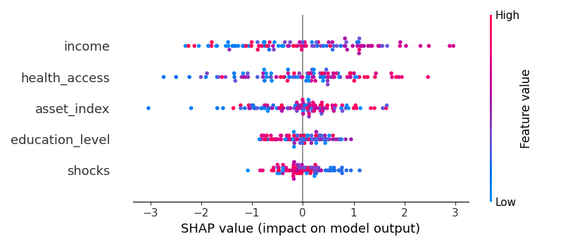
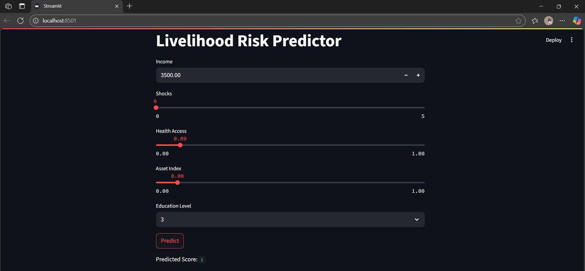
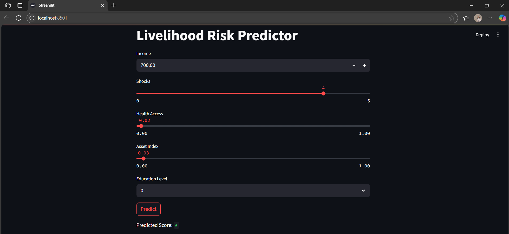

# 🧠 Livelihood Risk Predictor

A machine learning-powered Streamlit web app that predicts **household vulnerability score** based on income, shocks, health access, asset index, and education level. Built with FastAPI + XGBoost + SHAP for model explainability.
## 🔍 SHAP Summary Plot

This plot shows feature importance using SHAP values:





---

## 🚀 Project Features

- 📡 **Fake API** to simulate real-world household data
- 🔍 **Data cleaning** and preprocessing pipeline
- 🎯 **XGBoost Classifier** to predict vulnerability
- 🔎 **SHAP analysis** for explainability
- 🌐 **FastAPI endpoint** for predictions (`/predict`)
- 📊 **Streamlit dashboard** for user-friendly input & score

---

## 📁 Folder Structure

livelihood-risk/
│
├── api/
│ └── main.py # FastAPI server with /predict
├── dashboard/
│ └── streamlit-app.py # Streamlit frontend
│
├── data/
│ └── cleaned_data.csv # Auto-generated after fetch
│
├── fake_api.py # Simulates /get_data endpoint
├── fetch_data.py # Pulls fake data and saves it
├── model_train.py # Trains and saves XGBoost model
├── run_project.bat # One-click project runner
├── model.pkl # Saved ML model
│
├── screenshot1.png # UI screenshot
├── screenshot2.png # UI screenshot
├── shap_summary.png # SHAP summary plot
├── README.md
└── .gitignore

yaml
Copy
Edit

---

## ⚙️ Setup Instructions

### 1. Clone Repo & Set Up Virtual Environment

```bash
git clone https://github.com/your-username/livelihood-risk.git
cd livelihood-risk
python -m venv venv
venv\Scripts\activate  # On Windows
pip install -r requirements.txt
2. Start Fake API (Terminal 1)
bash
Copy
Edit
venv\Scripts\activate
python -m uvicorn fake_api:app --reload --port 8000
3. Run Project Setup (Terminal 2)
bash
Copy
Edit
venv\Scripts\activate
./run_project.bat
4. Start Prediction API (Terminal 3)
bash
Copy
Edit
venv\Scripts\activate
python -m uvicorn api.main:app --reload --port 8500
5. Run Streamlit Dashboard (Terminal 4)
bash
Copy
Edit
venv\Scripts\activate
streamlit run dashboard/streamlit-app.py
📡 API Endpoints
GET /get_data → from fake_api.py

POST /predict → returns vulnerability score

json
Copy
Edit
POST http://localhost:8500/predict
{
  "income": 1000,
  "shocks": 2,
  "health_access": 0.7,
  "asset_index": 0.5,
  "education_level": 3
}
Response:

json
Copy
Edit
{ "vulnerability_score": 1 }
🛡️ Tech Stack
Python

FastAPI

Streamlit

XGBoost

SHAP

Pandas, NumPy

🤝 Contributing
Pull requests are welcome! For major changes, please open an issue first.